# LARISKA AI

LARISKA AI adalah **Sales Brain untuk UMKM Indonesia**. Sistem menerima chat dan voice note WhatsApp, memahami konteks pelanggan, menjalankan negosiasi harga dengan guardrail deterministik, lalu membantu checkout, pembayaran, dan tindak lanjut pesanan.

> Gemini tidak menentukan harga. Keputusan bisnis dibuat oleh LightGBM dan Python guardrails; Gemini hanya menangani ekstraksi bahasa terstruktur dan penyusunan respons natural.

## Kapabilitas MVP

- WhatsApp Cloud API: teks, interactive category list, voice note, receipt status, dan CTA pembayaran.
- Whisper `small` untuk transkripsi Bahasa Indonesia, dengan fallback `base` dan Gemini Audio.
- Intent/entity extraction: produk, kategori, kuantitas, dan harga penawaran.
- Adaptive Pricing: LightGBM + floor-price guardrail + stok real-time.
- Katalog Supabase: produk, SKU, satuan, spesifikasi, stok, reorder point, dan alias pencarian.
- Midtrans Sandbox: checkout, QRIS/payment link, webhook settlement, order paid, reservasi/pengurangan stok.
- Dashboard Next.js: produk, pelanggan, pesanan, status pembayaran, dan pemenuhan `paid -> shipped -> completed`.

## Arsitektur

```mermaid
flowchart LR
    C["Pelanggan\nWhatsApp"] --> M["Meta WhatsApp\nCloud API"]
    M --> W["FastAPI Webhook\n/api/whatsapp/webhook"]
    W -->|Voice note| STT["Whisper local STT\nFallback: Gemini Audio"]
    W -->|Teks / hasil STT| NLU["Gemini\nIntent + Entity"]
    NLU --> CTX["State Tracking\nSupabase"]
    CTX --> FEAT["Feature Builder\nmargin, stok, loyalitas,\ndiskon, waktu"]
    FEAT --> ML["LightGBM\nUsulan tindakan"]
    ML --> GR["Python Hard Guardrails\nFloor price + max discount"]
    GR --> RESP["Response Generator\nBahasa Indonesia"]
    RESP --> M
    M --> C

    CTX <--> DB[("Supabase\nproduk, chat, order, payment, inventory log")]
    GR --> CO["Checkout Engine"]
    CO --> MT["Midtrans Sandbox\nQRIS / payment link"]
    MT --> PW["Payment Webhook\n/api/payment/webhook"]
    PW --> DB
    DB --> API["Dashboard API"]
    API --> UI["Next.js Dashboard\nProducts · Orders · Insights · Live Demo"]
    UI --> LD["Local End-to-End Demo\nchannel replacement only"]
    LD -->|same production core| NLU
```



Prinsip arsitektur: **Gemini tidak pernah menentukan harga atau mengubah keputusan bisnis**. Gemini hanya memahami bahasa dan menyusun narasi. LightGBM memberi usulan tindakan, lalu Python hard guardrails menghitung harga final dan memastikan `final_price >= floor_price`.

### Reliabilitas percakapan

Sebelum jawaban dikirim, backend melakukan pemulihan konteks deterministik di kedua kanal (WhatsApp dan Local Demo):

- Nama produk dari LLM tidak dipakai bila tidak berlandaskan pesan pelanggan atau katalog/sesi yang valid.
- Nominal tawaran eksplisit selalu dipaksa masuk ke negosiasi dan guardrail, walaupun NLU salah mengklasifikasikannya.
- **Quote-lock per produk dan jumlah:** setelah LARISKA memberi counter-offer, penawaran berikutnya untuk produk/jumlah yang sama tidak boleh lebih mahal; keluhan pelanggan dijawab memakai quote aktif tersebut.
- Kuantitas pada pesan lanjutan dipulihkan dari riwayat percakapan, sehingga “pasin totalnya” atau “jadi checkout” tidak kembali ke satu unit.
- Ketertarikan paket multi-unit tanpa nominal dapat menerima counter-offer paket kecil yang deterministik (maksimum 4% dan tetap di atas floor price); ini dieksekusi Python setelah rekomendasi LightGBM, bukan oleh LLM.
- Harga penawaran terakhir dipertahankan dalam konteks, sehingga protes seperti “kok malah naik?” dijawab dengan perbandingan harga katalog dan penawaran aktif, bukan mengulang harga yang membingungkan.
- Variasi STT/lisan seperti `cekot`, `cekout`, `mana linknya`, dan `lanjut bayar` dipetakan ke checkout hanya bila produk sudah terikat pada konteks valid.
- Pertanyaan singkat tentang harga, stok, atau detail produk yang sudah dipilih dijawab dari katalog Supabase secara deterministik.
- Link pembayaran tidak pernah dibuat oleh LLM. Ia hanya dikirim setelah invoice Midtrans berhasil dibuat.

Jika informasi produk belum cukup jelas atau ada beberapa kandidat katalog, LARISKA meminta klarifikasi atau menampilkan pilihan yang relevan; sistem tidak memilih produk/harga secara acak.

## Menjalankan Lokal

Prasyarat: Python 3.11+, Node.js 20+, akun Supabase, WhatsApp Cloud API, Google Gemini API, dan Midtrans Sandbox.

```powershell
# Terminal 1 - backend
cd backend
python -m venv .venv
.\.venv\Scripts\Activate.ps1
pip install -r requirements.txt
uvicorn app.main:app --reload --port 8000
```

```powershell
# Terminal 2 - frontend
cd frontend
npm install
npm run dev
```

Frontend tersedia di `http://localhost:3000`, backend di `http://localhost:8000`, dan dokumentasi FastAPI di `http://localhost:8000/docs`.

### Runbook operasional: Backend → Frontend → ngrok → webhook

Gunakan **tiga terminal terpisah** dan biarkan semuanya tetap aktif selama pengujian WhatsApp atau pembayaran.

#### Terminal 1 — FastAPI backend

```powershell
cd D:\Project\lariska-ai\backend
.\.venv\Scripts\Activate.ps1
.\.venv\Scripts\uvicorn.exe app.main:app --reload --port 8000
```

Tunggu sampai muncul `Application startup complete`, lalu uji:

```powershell
Invoke-RestMethod http://127.0.0.1:8000/health
```

Respons yang diharapkan adalah `status: ok`. Jangan gunakan `uvicorn main:app`; titik masuk yang benar adalah `app.main:app`.

#### Terminal 2 — Next.js frontend

```powershell
cd D:\Project\lariska-ai\frontend
npm run dev
```

Buka `http://localhost:3000`. Local End-to-End Demo dapat dipakai hanya dengan Terminal 1 dan 2; ngrok tidak diperlukan untuk chat dashboard lokal.

#### Terminal 3 — ngrok untuk webhook publik

```powershell
ngrok http 8000
```

Salin URL HTTPS yang ditampilkan, misalnya `https://nama-acak.ngrok-free.dev`. URL berubah setiap kali ngrok free dihentikan/dijalankan ulang; setiap perubahan URL harus diperbarui di Meta dan Midtrans.

#### Contoh URL tunnel aktif

Jika terminal ngrok menampilkan:

```text
Forwarding  https://ravioli-turf-cradling.ngrok-free.dev -> http://localhost:8000
```

maka URL yang harus ditempel adalah **persis** berikut (bukan URL dasar saja):

| Pengaturan | Nilai yang ditempel |
|---|---|
| Meta Callback URL | `https://ravioli-turf-cradling.ngrok-free.dev/api/whatsapp/webhook` |
| Midtrans Payment Notification URL | `https://ravioli-turf-cradling.ngrok-free.dev/api/payment/webhook` |
| Inspeksi request ngrok di komputer lokal | `http://127.0.0.1:4040` |

> URL `ravioli-turf-cradling.ngrok-free.dev` di atas hanya contoh dari sesi aktif tim. Jika ngrok direstart dan URL Forwarding berubah, ganti kedua URL webhook tersebut segera sebelum menguji WhatsApp atau pembayaran.

| Layanan | URL yang diisi | Tujuan |
|---|---|---|
| Meta WhatsApp Cloud API | `https://<ngrok-domain>/api/whatsapp/webhook` | menerima pesan, voice note, dan status delivery WhatsApp |
| Midtrans Sandbox Notification URL | `https://<ngrok-domain>/api/payment/webhook` | menerima status `pending`, `settlement`, `expire`, dan kegagalan pembayaran |

**Meta:** buka Meta Developer Dashboard → WhatsApp → Configuration, isi Callback URL di atas, masukkan Verify Token yang sama persis dengan `WHATSAPP_VERIFY_TOKEN` pada `backend/.env`, lalu pastikan subscription `messages` aktif.

**Midtrans:** buka Sandbox Dashboard → Settings → Configuration → Payment Notification URL, isi endpoint payment di atas lalu simpan. Gunakan tombol test notification bila tersedia setelah backend dan ngrok aktif.

> Jangan memasukkan URL dasar ngrok saja. Endpoint harus lengkap, termasuk `/api/whatsapp/webhook` untuk Meta atau `/api/payment/webhook` untuk Midtrans.

#### Urutan smoke test yang aman

1. Pastikan `/health` backend menjawab `ok` dan frontend dapat memuat produk.
2. Jalankan Local End-to-End Demo terlebih dahulu: detail → negosiasi → voice → `checkout` → invoice.
3. Pastikan ngrok menampilkan request yang masuk sebelum menguji WhatsApp atau Midtrans.
4. Kirim satu pesan WhatsApp ke nomor LARISKA. Log backend harus mencatat `POST /api/whatsapp/webhook 200`.
5. Setelah pembayaran Sandbox, Midtrans harus mengirim `POST /api/payment/webhook 200`; kemudian periksa order `paid`, payment `success`, serta stok/log inventory di dashboard.

## Panduan akses untuk panitia/penguji

> **Panitia tidak perlu mendaftarkan nomor WhatsApp pribadi ke Meta dan tidak perlu diberi token tim.** Jalur evaluasi yang direkomendasikan adalah dashboard lokal + Live Demo API. Integrasi WhatsApp live dibuktikan melalui Video Proof of Work dan dapat diuji langsung oleh panitia hanya bila tim secara sukarela menambahkan nomor penguji sebagai tester atau telah men-deploy aplikasi Meta dalam Live Mode.

### 1. Dashboard dan Local End-to-End Demo — tidak memerlukan akun Meta

Setelah backend dan frontend dijalankan, buka `http://localhost:3000/login`.

Login pada MVP ini adalah **UI demo**, bukan autentikasi produksi. Kredensial yang terisi otomatis dapat langsung digunakan untuk masuk. Halaman utama yang dapat diperiksa:

| Halaman | URL | Tujuan |
|---|---|---|
| Command Center | `http://localhost:3000/command-center` | ringkasan operasional dan alur sistem |
| Products | `http://localhost:3000/products` | katalog, harga, floor price, stok, SKU, dan spesifikasi |
| Live Demo | `http://localhost:3000/sales-brain` | kanal lokal untuk menguji inti pipeline produksi tanpa WhatsApp |
| Orders | `http://localhost:3000/orders` | order, payment, dan status pemenuhan |
| Customers | `http://localhost:3000/customers` | data pelanggan dan konteks operasional |
| Insights | `http://localhost:3000/insights` | ringkasan negosiasi/operasional |
| API docs | `http://localhost:8000/docs` | kontrak endpoint FastAPI |

Untuk menjalankan Live Demo dari komputer lain dalam satu jaringan, ubah `NEXT_PUBLIC_API_BASE_URL` agar mengarah ke IP komputer backend, bukan `localhost`, lalu jalankan frontend kembali. Contoh:

```env
NEXT_PUBLIC_API_BASE_URL=http://192.168.x.x:8000
```

Pada halaman **Live Demo**, pilih produk aktif lalu lakukan urutan berikut:

1. Tulis pertanyaan detail/stok atau penawaran harga. Browser hanya mengirim teks, `product_id`, dan ID sesi.
2. Backend membaca ulang harga, floor price, stok, dan riwayat sesi dari Supabase; kemudian menjalankan Gemini NLU, emotion classifier, LightGBM, serta Python guardrail yang sama dengan webhook WhatsApp.
3. Klik ikon rekam untuk membuat voice note langsung dari browser, lalu hentikan rekaman untuk menguji Whisper. Tombol unggah OGG/MP3/WAV/M4A tetap tersedia sebagai *fixture* audio reproducible untuk pengujian panitia; hasil transkripsi muncul sebelum diproses ke pipeline yang sama.
4. Setelah pelanggan mengirim pesan `checkout` (termasuk variasi lisan hasil STT seperti `cekot`/`cekout`), langkah **Buat invoice pembayaran** terbuka. Sistem juga mempertahankan kuantitas dari tawaran sebelumnya. Langkah ini membuat order pending, reservasi stok, dan tautan Midtrans Sandbox. Selesaikan pembayaran di sandbox bila kredensial Midtrans dikonfigurasi. Webhook pembayaran tetap membutuhkan URL HTTPS publik (misalnya tunnel aktif atau deployment).

Apabila jaringan Midtrans Sandbox mengalami kegagalan sementara, payment client mencoba ulang hingga tiga kali dengan *backoff* singkat. Jika tetap gagal, reservation/order pending dibatalkan dan stok dilepas agar pelanggan dapat mencoba lagi tanpa risiko stok terkunci.

Dengan demikian, Local End-to-End Demo **bukan** respons yang dihitung di browser atau mock chatbot. Ia mengganti transport Meta WhatsApp saja agar source code dapat dievaluasi secara reproducible.

### 2. WhatsApp live — opsional untuk pengujian langsung

Mode WhatsApp live tidak menjadi prasyarat untuk menjalankan atau mengevaluasi source code MVP. Ia memerlukan akun Meta, nomor bisnis, token, dan webhook publik milik pemilik proyek; kredensial tersebut sengaja tidak disertakan untuk menjaga keamanan akun dan data.

- **Jalur panitia (direkomendasikan):** jalankan dashboard dan gunakan halaman **Live Demo**. Endpoint `/api/sales-brain/demo/message` menjalankan inti produksi: NLU, emotion, state Supabase, LightGBM, hard guardrail, dan response generator tanpa Meta dan tanpa nomor telepon.
- **Meta Development mode (opsional):** bila panitia ingin mengirim pesan WhatsApp asli, pemilik proyek dapat menambahkan nomor tersebut sebagai **test recipient** di Meta Developer Dashboard → WhatsApp → API Setup. Ini adalah pembatasan platform Meta, bukan syarat penggunaan dashboard LARISKA.
- **Meta Live/Production mode (roadmap deployment):** aplikasi Meta dipublish, nomor bisnis aktif, permission sesuai, dan backend berada pada URL HTTPS publik. Dalam kondisi ini, siapa pun dapat mengirim pesan ke nomor LARISKA tanpa didaftarkan satu per satu.
- **Ngrok hanya untuk demo sementara:** URL tunnel harus aktif dan webhook Meta serta Midtrans harus mengarah ke endpoint publik yang sama. Untuk pengujian mandiri/reproducible, gunakan dashboard + API lokal atau deploy backend ke hosting publik.

Jangan memasukkan nomor WhatsApp, access token, API key, URL Supabase service role, maupun Midtrans server key milik tim ke README atau repositori publik.

## Konfigurasi inti

Buat `backend/.env` dari nilai akun Anda. Jangan commit secret.

```env
SUPABASE_URL=
SUPABASE_ANON_KEY=
SUPABASE_SERVICE_ROLE_KEY=
DATABASE_URL=
WHATSAPP_TOKEN=
WHATSAPP_PHONE_NUMBER_ID=
WHATSAPP_VERIFY_TOKEN=
WHATSAPP_APP_SECRET=
GEMINI_API_KEY=
GEMINI_MODEL=gemini-3.5-flash-lite
WHISPER_MODEL_PATH=small
MIDTRANS_SERVER_KEY=
MIDTRANS_CLIENT_KEY=
MIDTRANS_IS_PRODUCTION=false
APP_SECRET_KEY=
```

Untuk Meta Development mode, setiap nomor penguji harus didaftarkan sebagai test recipient. Nomor bisnis production dan aplikasi Meta yang dipublish diperlukan untuk melayani publik tanpa pendaftaran satu per satu.

## Verifikasi

```powershell
cd backend
.\.venv\Scripts\python.exe -m pytest -q --ignore=tests/test_live_all.py

cd ..\frontend
npm run build
```

Suite offline memverifikasi kontrak Pydantic, guardrail floor price, checkout/payment, handover, WhatsApp client, dan dashboard endpoint tanpa menghabiskan kuota Gemini.

## Data dan evaluasi ML

Artefak LightGBM berada di `ml/model_artifacts/`. Model bootstrap dilatih dari **5.000 data negosiasi sintetis**, split stratified 80:20, `random_state=42`, dan label noise 8%.

- Accuracy hold-out sintetis: **89,2%**
- Macro F1 hold-out sintetis: **83,2%**

Angka tersebut bukan ukuran performa pada transaksi UMKM nyata. Roadmapnya adalah evaluasi pilot dan retraining batch berizin dari log negosiasi yang telah dianonimkan.

## Skenario demo yang disarankan

1. **Local End-to-End Demo:** pilih produk, tanya detail/stok, lalu tawar harga di atas dan di bawah floor price. Perlihatkan decision trace yang selalu menjaga floor price.
2. **Voice:** unggah satu voice note Bahasa Indonesia; tunjukkan transkripsi Whisper dan respons pipeline.
3. **Transaksi:** buat invoice, buka tautan Midtrans Sandbox, lalu lakukan settlement. Perlihatkan `payment success`, `order paid`, stok/inventory berubah, serta alur `paid → shipped → completed` di dashboard.
4. **WhatsApp (bukti integrasi):** tunjukkan percakapan nyata, menu kategori, voice note, negosiasi, dan CTA pembayaran. Mode ini mengikuti kebijakan nomor penguji/lifecycle Meta.
