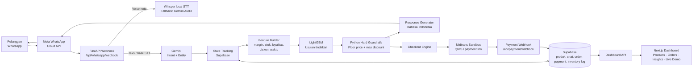

# LARISKA AI

LARISKA AI adalah **Sales Brain untuk UMKM Indonesia**. Sistem menerima chat dan voice note WhatsApp, memahami konteks pelanggan, menjalankan negosiasi harga dengan guardrail deterministik, lalu membantu checkout, pembayaran, dan tindak lanjut pesanan.

> Gemini tidak menentukan harga. Keputusan bisnis dibuat oleh LightGBM dan Python guardrails; Gemini hanya menangani ekstraksi bahasa terstruktur dan penyusunan respons natural.

## Kapabilitas MVP

- WhatsApp Cloud API: teks, interactive category list, voice note, receipt status, dan CTA pembayaran.
- Whisper `small` untuk transkripsi Bahasa Indonesia, dengan fallback `base` dan Gemini Audio.
- Intent/entity extraction: produk, kategori, kuantitas, dan harga penawaran.
- Adaptive Pricing: LightGBM + floor-price guardrail + stok real-time.
- Katalog Supabase: produk, SKU, satuan, spesifikasi, stok, reorder point, dan alias pencarian.
- Midtrans Sandbox: checkout, QRIS/payment link, webhook settlement, order paid, reservasi/pengurangan stok.
- Dashboard Next.js: produk, pelanggan, pesanan, status pembayaran, dan pemenuhan `paid -> shipped -> completed`.

## Arsitektur



Prinsip arsitektur: **Gemini tidak pernah menentukan harga atau mengubah keputusan bisnis**. Gemini hanya memahami bahasa dan menyusun narasi. LightGBM memberi usulan tindakan, lalu Python hard guardrails menghitung harga final dan memastikan `final_price >= floor_price`.

## Menjalankan Lokal

Prasyarat: Python 3.11+, Node.js 20+, akun Supabase, WhatsApp Cloud API, Google Gemini API, dan Midtrans Sandbox.

```powershell
# Terminal 1 - backend
cd backend
python -m venv .venv
.\.venv\Scripts\Activate.ps1
pip install -r requirements.txt
uvicorn app.main:app --reload --port 8000
```

```powershell
# Terminal 2 - frontend
cd frontend
npm install
npm run dev
```

Frontend tersedia di `http://localhost:3000`, backend di `http://localhost:8000`, dan dokumentasi FastAPI di `http://localhost:8000/docs`.

## Panduan akses untuk panitia/penguji

> **Panitia tidak perlu mendaftarkan nomor WhatsApp pribadi ke Meta dan tidak perlu diberi token tim.** Jalur evaluasi yang direkomendasikan adalah dashboard lokal + Live Demo API. Integrasi WhatsApp live dibuktikan melalui Video Proof of Work dan dapat diuji langsung oleh panitia hanya bila tim secara sukarela menambahkan nomor penguji sebagai tester atau telah men-deploy aplikasi Meta dalam Live Mode.

### 1. Dashboard dan mode demo lokal — tidak memerlukan akun Meta

Setelah backend dan frontend dijalankan, buka `http://localhost:3000/login`.

Login pada MVP ini adalah **UI demo**, bukan autentikasi produksi. Kredensial yang terisi otomatis dapat langsung digunakan untuk masuk. Halaman utama yang dapat diperiksa:

| Halaman | URL | Tujuan |
|---|---|---|
| Command Center | `http://localhost:3000/command-center` | ringkasan operasional dan alur sistem |
| Products | `http://localhost:3000/products` | katalog, harga, floor price, stok, SKU, dan spesifikasi |
| Live Demo | `http://localhost:3000/sales-brain` | simulasi endpoint Sales Brain tanpa WhatsApp |
| Orders | `http://localhost:3000/orders` | order, payment, dan status pemenuhan |
| Customers | `http://localhost:3000/customers` | data pelanggan dan konteks operasional |
| Insights | `http://localhost:3000/insights` | ringkasan negosiasi/operasional |
| API docs | `http://localhost:8000/docs` | kontrak endpoint FastAPI |

Untuk menjalankan Live Demo dari komputer lain dalam satu jaringan, ubah `NEXT_PUBLIC_API_BASE_URL` agar mengarah ke IP komputer backend, bukan `localhost`, lalu jalankan frontend kembali. Contoh:

```env
NEXT_PUBLIC_API_BASE_URL=http://192.168.x.x:8000
```

### 2. WhatsApp live — opsional untuk pengujian langsung

Mode WhatsApp live tidak menjadi prasyarat untuk menjalankan atau mengevaluasi source code MVP. Ia memerlukan akun Meta, nomor bisnis, token, dan webhook publik milik pemilik proyek; kredensial tersebut sengaja tidak disertakan untuk menjaga keamanan akun dan data.

- **Jalur panitia (direkomendasikan):** jalankan dashboard dan gunakan halaman **Live Demo**. Endpoint `/api/sales-brain/negotiate` menjalankan LightGBM dan hard guardrail yang sama dengan jalur WhatsApp, tanpa Meta dan tanpa nomor telepon.
- **Meta Development mode (opsional):** bila panitia ingin mengirim pesan WhatsApp asli, pemilik proyek dapat menambahkan nomor tersebut sebagai **test recipient** di Meta Developer Dashboard → WhatsApp → API Setup. Ini adalah pembatasan platform Meta, bukan syarat penggunaan dashboard LARISKA.
- **Meta Live/Production mode (roadmap deployment):** aplikasi Meta dipublish, nomor bisnis aktif, permission sesuai, dan backend berada pada URL HTTPS publik. Dalam kondisi ini, siapa pun dapat mengirim pesan ke nomor LARISKA tanpa didaftarkan satu per satu.
- **Ngrok hanya untuk demo sementara:** URL tunnel harus aktif dan webhook Meta serta Midtrans harus mengarah ke endpoint publik yang sama. Untuk pengujian mandiri/reproducible, gunakan dashboard + API lokal atau deploy backend ke hosting publik.

Jangan memasukkan nomor WhatsApp, access token, API key, URL Supabase service role, maupun Midtrans server key milik tim ke README atau repositori publik.

## Konfigurasi inti

Buat `backend/.env` dari nilai akun Anda. Jangan commit secret.

```env
SUPABASE_URL=
SUPABASE_ANON_KEY=
SUPABASE_SERVICE_ROLE_KEY=
DATABASE_URL=
WHATSAPP_TOKEN=
WHATSAPP_PHONE_NUMBER_ID=
WHATSAPP_VERIFY_TOKEN=
WHATSAPP_APP_SECRET=
GEMINI_API_KEY=
GEMINI_MODEL=gemini-3.5-flash-lite
WHISPER_MODEL_PATH=small
MIDTRANS_SERVER_KEY=
MIDTRANS_CLIENT_KEY=
MIDTRANS_IS_PRODUCTION=false
APP_SECRET_KEY=
```

Untuk Meta Development mode, setiap nomor penguji harus didaftarkan sebagai test recipient. Nomor bisnis production dan aplikasi Meta yang dipublish diperlukan untuk melayani publik tanpa pendaftaran satu per satu.

## Verifikasi

```powershell
cd backend
.\.venv\Scripts\python.exe -m pytest -q --ignore=tests/test_live_all.py

cd ..\frontend
npm run build
```

Suite offline memverifikasi kontrak Pydantic, guardrail floor price, checkout/payment, handover, WhatsApp client, dan dashboard endpoint tanpa menghabiskan kuota Gemini.

## Data dan evaluasi ML

Artefak LightGBM berada di `ml/model_artifacts/`. Model bootstrap dilatih dari **5.000 data negosiasi sintetis**, split stratified 80:20, `random_state=42`, dan label noise 8%.

- Accuracy hold-out sintetis: **89,2%**
- Macro F1 hold-out sintetis: **83,2%**

Angka tersebut bukan ukuran performa pada transaksi UMKM nyata. Roadmapnya adalah evaluasi pilot dan retraining batch berizin dari log negosiasi yang telah dianonimkan.

## Demo yang disarankan

1. Kirim “Halo” untuk membuka menu kategori katalog.
2. Pilih kategori, lalu tanya detail, stok, dan harga produk.
3. Kirim voice note pertanyaan produk.
4. Nego multi-unit tanpa melanggar floor price.
5. Checkout dan selesaikan pembayaran Midtrans Sandbox.
6. Tunjukkan payment success, order paid, stok berkurang, lalu status shipped/completed di dashboard.
